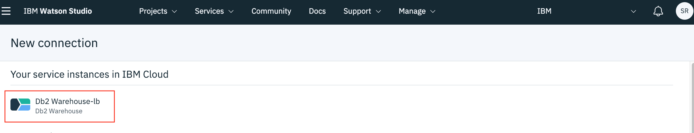
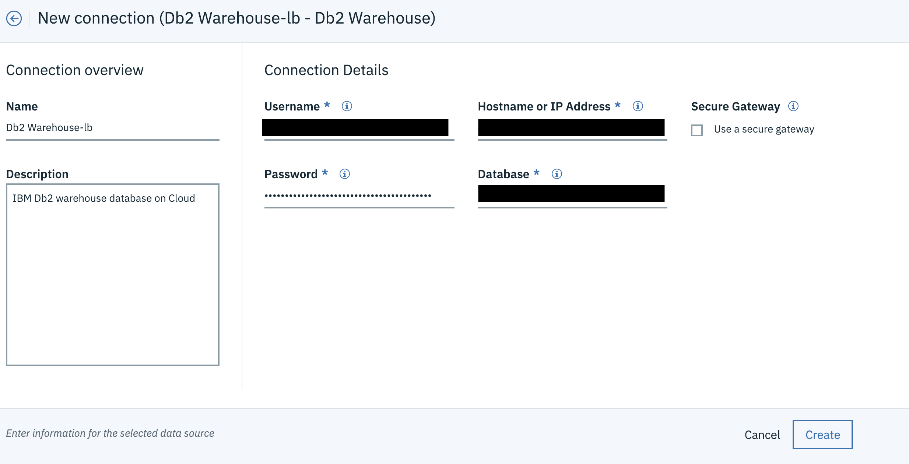
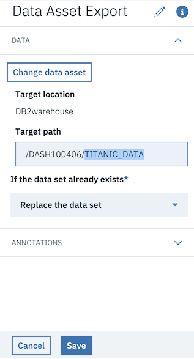

---
#Front matter (metadata).
abstract:               IBM SPSS Modeler provides predictive analytics to help you uncover data patterns, gain predictive accuracy and improve decision making. This tutorial demonstrated an end to end flow of how to use SPSS Modeler on Watson Studio by ingesting data in a database, perform analytics and storing back the results as a new table in the database.

authors:                # REQUIRED - Note: can be one or more
  - name: Smruthi Raj Mohan
    email: smrraj32@in.ibm.com

completed_date:         # REQUIRED - Note: date format is YYYY-MM-DD

components:
# For a full list of options see https://github.ibm.com/IBMCode/Definitions/blob/master/components.yml
# Use the "slug" value found at the link above to include it in this content.
# Example (remove the # to uncomment):
 # - "aix"

draft: true|false       # REQUIRED

excerpt:                # REQUIRED

keywords:               # REQUIRED - comma separated list

last_updated:           # REQUIRED - Note: date format is YYYY-MM-DD

primary_tag:          # REQUIRED - Note: Choose only only one primary tag. Multiple primary tags will result in automation failure. Additional non-primary tags can be added below.

pta:                    # REQUIRED - Note: can be only one
# For a full list of options see https://github.ibm.com/IBMCode/Definitions/blob/master/primary-technology-area.yml
# Use the "slug" value found at the link above to include it in this content.
# Example (remove the # to uncomment):
 # - "cloud, container, and infrastructure"

pwg:                    # REQUIRED - Note: can be one or many
# For a full list of options see https://github.ibm.com/IBMCode/Definitions/blob/master/portfolio-working-group.yml
# Use the "slug" value found at the link above to include it in this content.
# Example (remove the # to uncomment):
# - "containers"

related_content:        # OPTIONAL - Note: zero or more related content
  - type: announcements|articles|blogs|patterns|series|tutorials|videos
    slug:

related_links:           # OPTIONAL - Note: zero or more related links
  - title:
    url:
    description:

runtimes:               # OPTIONAL - Note: Select runtimes from the complete set of runtimes below. Do not create new runtimes. Only use runtimes specifically in use by your content.
# For a full list of options see https://github.ibm.com/IBMCode/Definitions/blob/master/runtimes.yml
# Use the "slug" value found at the link above to include it in this content.
# Example (remove the # to uncomment):
 # - "asp.net 5"

series:                 # OPTIONAL
 - type:
   slug:

services:               # OPTIONAL - Note: please select services from the complete set of services below. Do not create new services. Only use services specifically in use by your content.
# For a full list of options see https://github.ibm.com/IBMCode/Definitions/blob/master/services.yml
# Use the "slug" value found at the link above to include it in this content.
# Example (remove the # to uncomment):
# - "blockchain"

subtitle:               # REQUIRED

tags:
# Please select tags from the complete set of tags below. Do not create new tags. Only use tags specifically targeted for your content. If your content could match all tags (for example cloud, hybrid, and on-prem) then do not tag it with those tags. Less is more.
# For a full list of options see https://github.ibm.com/IBMCode/Definitions/blob/master/tags.yml
# Use the "slug" value found at the link above to include it in this content.
# Example (remove the # to uncomment):
 # - "blockchain"

title:                  # REQUIRED

translators:             # OPTIONAL - Note: can be one or more
  - name:
    email:

type: tutorial|howto    # REQUIRED

---

# Set up SPSS Modeler on Watson Studio with DB2 Warehouse Connection

IBM SPSS Modeler provides predictive analytics to help you uncover data patterns, gain predictive accuracy and improve decision making. This tutorial demonstrates an end to end flow of how to use SPSS Modeler on Watson Studio by ingesting data in a DB2 Warehouse database, perform analytics and storing back the results as a new table in the same database.

## Learning objectives
A user will learn how to:

1. Add the DB2 Warehouse Connection in Watson Studio.
2. Create a new SPSS Modeller stream or add an existing SPSS Modeller.
3. Run the SPSS Modeller and store output on DB2 Warehouse.

## Prerequisites

* [IBM Cloud Account](https://console.bluemix.net/registration/)
* [Object Storage Service Instance](https://console.bluemix.net/catalog/services/cloud-object-storage) from the IBM Cloud catalog
* [Watson Studio Service Instance](https://console.bluemix.net/catalog/services/watson-studio) from the IBM Cloud catalog
* [DB2 Warehouse Service Instance](https://cloud.ibm.com/catalog/services/db2-warehouse) from the IBM Cloud catalog
* For this tutorial, we will be using Titanic Dataset from Kaggle which can be found here- https://www.kaggle.com/c/titanic/data. Once you download the dataset, unzip the file onto your local file system.

## Estimated time

Completing this tutorial should take about 30 minutes.

## Steps

### 1. Load Sample Data in DB2 warehouse

* Open your [IBM Cloud Dashboard](https://cloud.ibm.com/) and under `Cloud Foundry Services` open your created `DB2 Warehouse instance`.
* Click on `Open Console` in the page opened, as given below.

* Once the service opens up, From the side menu, click on the `load` option.

* Select the `train.csv` file from the unzipped data folder from Kaggle.

* Once you load select your appropriate Schema, usually specified as DASH followed by a series of numbers. Click on the `New Table` option as shown.

* Name it `TITANIC_DATA` or any other name of your choice. And click on `Begin Load`.

### 2. Add the DB2 Warehouse Connection in Watson Studio

* Open your Watson Studio from IBM Cloud Dashboard and Navigate to the created project or create a new `Modeler` Project and make sure you link your Cloud Object Storage instance to the Project.

* Click on the `Add to Project` button and select `Connection`.

* Select your `DB2 Warehouse` instance created on IBM Cloud.

* The details would already be filled and click the `Create` button.

### 3. Create the SPSS Modeler and insert data from DB2 Warehouse

* Click on the `Add to Project` button and select `Modeler`.

* Enter the a name for the modeler and make sure the below options are selected, and click on `Create`.

* On the Right side menu under the `Import` tab drag and drop the `Data Assets` node.

* Click on the `Connections` tab, select `DB2Warehouse` and select the schema and the uploaded table. Next, click on `Save`.

### 4. Visualize, Analyze and perform Feature Selection with SPSS Modeler

* Given a dataset, SPSS Modeler provides many visualisation tools to understand the data. In this section, the tutorial will show how to create these Visualisations and get insights from the data.

#### Visualize

* In the options of the `Data Asset` node, click on the Preview option and go to `Visualisations` tab.

* Histograms are used to show the distribution of the data, in this example, plot a graph by taking `Age` in the x-axis and split-by `sex`.

From this graph we can see that the ages of the passengers, follows a normal distribution, i.e, most ppl have an age range of 20-55, and there are fewer ppl who are less than 20 and greater than 50. We can also see that, for some age grps, there are more number of men than women.

* A bar diagram makes it easy to compare sets of data between different groups at a glance. Here we see the comparison between the number of male survivors and the number of female survivors. Taking `sex` as the category, Summary value as `count` and the value option as `Survived`.

* A pie chart is best used when trying to work out the composition of something. In this case we give the category as `Cabin`.

From this pie chart, we can see that 80% of the `Cabin` column has NaNs that is missing values. So, we can make a conclusion to drop this column since we know it cannot affect the target, in our case the Survived column.

#### Feature Selection

* Before using Feature Selection, we need to prepare the dataset. First we use `Filler` to fill in all missing values with null and NaN values. Next, we filter out the `Cabin` column from the Visualization stage using `Filter` node. And, finally we assign the correct `Type` to each field and also set the Target field as `Survived`.

* Use the Feature Selection under the `Modeling` tab. and run the modeler.

* A model node will be generated, while connecting to a `Table` node in the `Output` tab, you can see it filters out the unimportant columns.

### 5. Save Data Back to DB2 Warehouse

* Add the `Data Asset Export` node from `Export` tab. 
* Follow the steps from [1. Load Sample Data in DB2 warehouse](#-1-load-sample-data-in-db2-warehouse) to connect your DB2 Warehouse instance and select any table in that.
* Before saving the changes for the node. Enter a name for the output table, make sure the name is unique to the table names within the schema.

* Run the modeler flow and the desired output will be saved in the `DB2 Warehouse`.

## Related Links

* https://developer.ibm.com/tutorials/spss-data-modelling-prediction/
* https://developer.ibm.com/tutorials/build-and-compare-models-using-ibm-spss-modeler/

## Summary

In this how-to, you learnt-
* How to load data from DB2 Warehouse onto SPSS Modeler. 
* How to work with SPSS nodes to perform the initial Visualizations, pre-processing and Feature Engineering of a given dataset.
* How to store back data directly to DB2 Warehouse.
